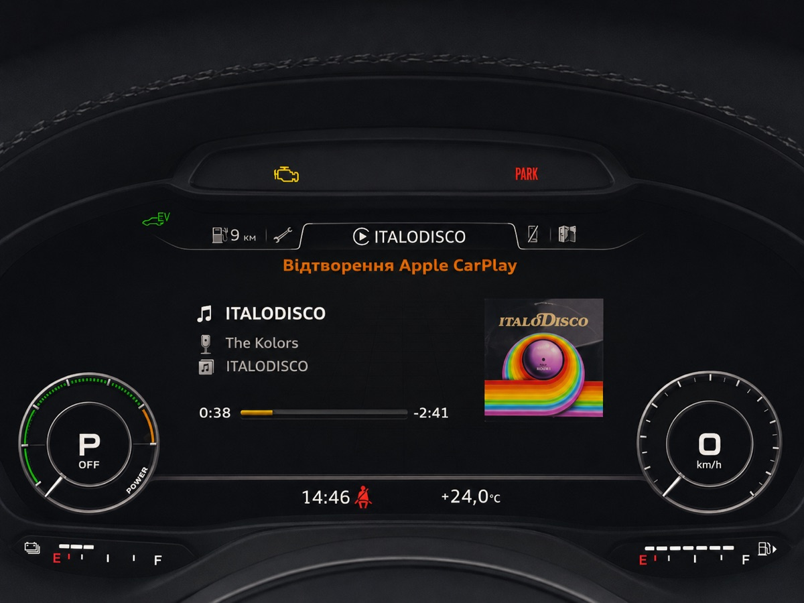

# MHI2 AU37x CarPlay patches

Two patches for Audi MHI2 head units on the **`MHI2_ER_AU37x`** train:

- **Cover art** — CarPlay album artwork on the Virtual Cockpit's now-playing widget.
  Stock forwards title/artist/album to the cluster but never the picture.
- **Touchpad → D-pad** — the MMI touchpad navigates CarPlay menus. Stock bridges the
  rotary, the knob press, back and the softkeys, but leaves the touchpad dead.

Prebuilt binaries only. Two ways to install: straight over a network cable, or from an
M.I.B. SD card.

> **Use at your own risk.** These patches copy files onto the head unit's flash and edit
> one system config. Everything is reversible and the installer backs up the one file it
> changes, but a head unit is not a toy. Read [Recovery](#recovery) *before* you start,
> and make sure you can get a shell on the unit without the screen.

## Gallery

<p align="center"></p>

<p align="center"><sub>CarPlay album art on the Virtual Cockpit — stock leaves this tile empty.</sub></p>

## Compatibility — read this first

**Tested on exactly one build:**

| Property | Value |
|---|---|
| Train | `MHI2_ER_AU37x_P5089` |
| MU | `MU1326` |
| Part number | `8V1035036A` |
| Car | Audi A3 8V Sportback e-tron (2017), Virtual Cockpit (`KI_FPK_AU37X`) |
| iAP2 stack | HARMAN (`mm-ipod` + `libiap2client.so.1`), Media 1.0.61.9 |

Other `MHI2_ER_AU37x_*` builds are **expected** to work but are **not verified**, and the
failure mode is worth understanding before you try:

- The jars do not add code alongside the stock HMI, they **replace three stock classes
  outright** (`AppConnectorTerminalMode`, `TerminalModeBapCombi$EventListener`,
  `CarplayDSILifecycleController$TerminalModeDSIKeyEventsController`). Each carries a copy
  of that class from the build above. If your build's version differs, the replacement can
  fail when the class loads — and since one of them is constructed during HMI audio-module
  init, that can mean the HMI does not come up, not just a dead feature.
- The native hook resolves `iap2_nowplay_getartwork` / `iap2_filexfer_read` out of
  `libiap2client.so.1` by name. A different driver version fails softly: a line in the log,
  no cover art, nothing broken.

Two checks on the unit before installing — **with an iPhone plugged in**:

```sh
pidin ar | grep mm-ipod          # HARMAN iAP2 stack running?
ls /ramdisk/pps/iap2/            # device, location, nowplaying, telephony
```

`mm-ipod` is started when a device is connected, and `/ramdisk/pps/iap2/` only exists
while it runs. With nothing plugged in, the first prints only your own `grep` and the
second says *No such file or directory* — that is normal and tells you nothing.

If there is no `mm-ipod` and `dio_manager` contains `NmeIAP2Message` symbols, you are on
the Cinemo/Qualcomm stack (MHI2Q) — these binaries are not for you; see
[mib2q-carplay-rgi](https://github.com/luka-dev/mib2q-carplay-rgi).

**Cover art additionally needs the cluster coded for it.** In module **17** (instrument
cluster), adaptation `Picture_Upload_Download` must be **active**. With it inactive the
cluster never asks for a picture and nothing on the head-unit side can help. The D-pad
patch needs no coding.

**Lowest-risk option:** the D-pad patch is self-contained. Copy only
`bin/dpad_hook.jar` into `/mnt/app/eso/hmi/lsd/jars/` — no native hook, no config edit,
uninstall is deleting the file.

## Contents

| Path | What it is |
|---|---|
| `bin/coverart_hook.jar` | HMI patch: pushes the artwork to the cluster and answers its picture requests |
| `bin/dpad_hook.jar` | HMI patch: touchpad drag → CarPlay D-pad |
| `bin/libcarplay_hook.so` | Native hook (ARM/QNX), `LD_PRELOAD`ed into `dio_manager`: pulls the artwork out of iAP2, decodes it, writes a 170×170 PNG |
| `install.sh` | Runs **on the unit**; does the whole install, idempotent |
| `uninstall.sh` | Runs on the unit; puts everything back |
| `custom.sh` | M.I.B. entry point — finds the payload on the card and calls the above |

## Before you copy anything: Windows line endings

If you are on Windows, **download this repository fresh** (clone again, or Code →
Download ZIP). Earlier copies were checked out with CRLF line endings and every script in
them fails on the unit; `.gitattributes` now pins LF, but it only affects new downloads.

You have a CRLF copy if the unit answers like this:

```
: cannot execute - No such file or directory
: unknown option
install.sh[21]: set:
```

Repairing it **on the unit** is harder than it sounds, because the unit is missing most of
the tools you would reach for. This is the complete inventory:

```
/bin      cat chgrp chkqnx6fs chmod chown cp dd df dinit echo fdisk flashctl getconf
          head hogs if_up ksh link ln login ls mkdir mkqnx6fs mount mv on pidin rm
          setconf sh slay sleep sloginfo swaitfor sync sysctl tail touch umount uname
          usb use vi waitfor waitforpoll
/usr/bin  cut fsmounter grep sort tee
```

No `sed`, no `awk`, no `tr`, no `printf`. What does work is `vi`:

```sh
vi install.sh
```

Type `:%s/` then **Ctrl-V Ctrl-M** (this inserts a literal carriage return, shown as `^M`)
then `//g` and Enter, so the command line reads `:%s/^M//g`. Then `:wq`. Repeat for
`uninstall.sh`. If vi reports *No match*, the file was already fine and the problem is
elsewhere.

Honestly though: fixing the line endings on your own machine before copying is less work
than any of this, and the [manual install](#manual-install--no-scripts) below needs no
scripts at all.

After any download, check the payload arrived intact — these are exact sizes:

```
bin/libcarplay_hook.so   124703
bin/coverart_hook.jar     26683
bin/dpad_hook.jar         11108
```

Or skip the scripts entirely: see [Manual install](#manual-install--no-scripts).

## Install A — network cable

Prerequisites, both from the M.I.B. menu:

1. `Advanced Settings → Info USB Ethernet devices → Install devices (again)`
2. `Advanced Settings → Install SSHD` (put your `id_rsa.pub` in the card's `Custom`
   folder first)

Plug the USB-Ethernet adapter in; the unit comes up on **`172.16.250.248`**.

```sh
# from your machine, in this repository
ssh root@172.16.250.248 'mount -uw /mnt/app; mkdir -p /mnt/app/root/carplay'
scp -O -r bin install.sh uninstall.sh root@172.16.250.248:/mnt/app/root/carplay/
ssh root@172.16.250.248 'sh /mnt/app/root/carplay/install.sh'
```

**Do not stage the files under `/tmp`.** On this unit `/tmp` is a symlink to
`/dev/shmem`, a flat shared-memory filesystem that has no directories at all —
`mkdir /tmp/carplay` fails with *Function not implemented*. Any writable spot on
`/mnt/app` works; the line above uses `/mnt/app/root/carplay`.

(`-O` is needed on recent macOS/OpenSSH, which defaults to SFTP; the unit only speaks the
legacy SCP protocol. Older systems: drop it. If the unit's host key is rejected, add
`-o HostKeyAlgorithms=+ssh-rsa -o PubkeyAcceptedKeyTypes=+ssh-rsa`.)

Then reboot the unit.

## Install B — M.I.B. SD card

Lay the card out like this:

```
/mod/custom.sh            <- copy of custom.sh from this repository
/mod/carplay/install.sh
/mod/carplay/uninstall.sh
/mod/carplay/bin/coverart_hook.jar
/mod/carplay/bin/dpad_hook.jar
/mod/carplay/bin/libcarplay_hook.so
```

Insert the card and run `Advanced Settings → Run Custom Script`. It locates the payload,
installs, and prints what it did.

Then reboot the unit.

To uninstall this way, create an empty file `/mod/carplay/UNINSTALL` on the card and run
the custom script again.

> Give the writes a moment before rebooting — the installer calls `sync` and waits, but a
> forced reboot immediately afterwards can still leave a file truncated, and you will be
> left wondering why nothing loaded.

## Manual install — no scripts

Nine commands on the unit. Do this if the scripts give you trouble, or if you would rather
see every change go by.

```sh
mount -uw /mnt/app
mount -uw /mnt/system

# 1. the jars
cp bin/dpad_hook.jar     /mnt/app/eso/hmi/lsd/jars/
cp bin/coverart_hook.jar /mnt/app/eso/hmi/lsd/jars/

# 2. the native hook
mkdir -p /mnt/app/eso/hmi/lib
cp bin/libcarplay_hook.so /mnt/app/eso/hmi/lib/

# 3. make all three readable (a jar lsd cannot read is skipped silently)
chmod 755 /mnt/app/eso/hmi/lsd/jars/dpad_hook.jar \
          /mnt/app/eso/hmi/lsd/jars/coverart_hook.jar \
          /mnt/app/eso/hmi/lib/libcarplay_hook.so

# 4. back up the one config you are about to edit
cp /mnt/system/etc/eso/production/smartphone_integrator.json \
   /mnt/system/etc/eso/production/smartphone_integrator.json.orig
```

Then edit the config — `vi` is on the unit:

```sh
vi /mnt/system/etc/eso/production/smartphone_integrator.json
```

Search for `IPL_CONFIG_DIR_DIO_MANAGER` (`/IPL_CONFIG_DIR_DIO_MANAGER` then Enter). It
appears exactly once, on the `carplay` child's `envs` line. Add one entry at the end of
that array, so the line ends like this:

```
… "IPL_CONFIG_DIR_DIO_MANAGER=/etc/eso/production", "LD_PRELOAD=/mnt/app/eso/hmi/lib/libcarplay_hook.so"],
```

Save and quit (`:wq`), then `sync`, wait a few seconds, and reboot.

**Only want the touchpad D-pad?** Step 1's first line plus its `chmod` is the whole
install — no hook, no config edit.

## What the installer changes

| Path | Change | Backup |
|---|---|---|
| `/mnt/app/eso/hmi/lsd/jars/coverart_hook.jar` | new file | — (delete to undo) |
| `/mnt/app/eso/hmi/lsd/jars/dpad_hook.jar` | new file | — (delete to undo) |
| `/mnt/app/eso/hmi/lib/libcarplay_hook.so` | new file | — (delete to undo) |
| `/mnt/system/etc/eso/production/smartphone_integrator.json` | one `LD_PRELOAD` entry added to the `carplay` child's `envs` | `…json.orig`, written once |

Nothing stock is overwritten, so only that one config needs a backup. The edit is
line-based on purpose: the file is JSON with `#` metadata and `##` comment lines that any
JSON rewriter would silently drop, and it is written *through* the existing file rather
than replacing it, so the config keeps its own mode and owner.

**Permissions.** The installer `chmod 755`s everything it copies. This matters on the SD
card path: FAT32 carries no Unix modes, so a jar can land unreadable, and `lsd` skips a
jar it cannot read without logging anything — you would see no patch and no error. Stock
files in that directory are `-rwxrwxrwx root:root`. The installer prints an `ls -l` of the
three files at the end so you can check. Nothing on the card needs the executable bit:
`custom.sh` is invoked as `sh custom.sh`, and it calls the other scripts the same way.

The jars need no loader change — `lsd.sh` already scans
`/mnt/app/eso/hmi/lsd/jars/` and puts what it finds on the bootclasspath *ahead* of
`lsd.jxe`, which is what lets a patched class win over the stock one.

## Verify

Both the native hook and the HMI patch log to the same file on the unit. Plug in an
iPhone, play something with artwork, then:

```sh
cat /tmp/carplay_hook.log
```

A healthy cover-art run looks like this:

```
[INF] new artwork id=130 size=53964
[INF] artwork decoded 600x600 (3 ch) -> 170x170
[INF] published coverart: crc=b5012bdf size=53964
[CarplayBus] hook connected from /127.0.0.1
[CoverArt] New cover art: crc=b5012bdf
[CoverArtProvider] requestPicture entryID=0 sourceType=0 known=true
```

That last line is the cluster asking for the picture — if it never appears, check the
module 17 adaptation. The installer's own log is at `/tmp/carplay_install.log`.

## Upgrading

Just run `install.sh` again — there is no need to uninstall first. It overwrites the
files, keeps the `.orig` backup it already made, and leaves the config alone once our
`LD_PRELOAD` entry is there. The hook is put in place with `rename`, so an upgrade does
not disturb a `dio_manager` that happens to be running; the new one takes effect at the
next start.

Reboot afterwards, as with a first install.

## Uninstall

```sh
ssh root@172.16.250.248 'sh /mnt/app/root/carplay/uninstall.sh'
```

or the `UNINSTALL` marker file described above. Reboot afterwards. The `.orig` backup is
deliberately left behind; remove it by hand if you want no trace.

## Troubleshooting

**`./install.sh: No such file or directory` — but the file is right there and
executable.** Also `: unknown optionset: -` and `install.sh[21]: set:`. The scripts have
Windows line endings. `#!/bin/sh` became `#!/bin/sh\r`, so the shell looks for an
interpreter that does not exist, and `set -u\r` is not a valid command either.

Git on Windows converts to CRLF on checkout by default. This repository now pins LF for
`*.sh` in `.gitattributes`, so **re-download it** (clone again, or Code → Download ZIP)
and the copies will be correct. If you would rather fix the working copy you already
have: `git config --global core.autocrlf input`, then delete the clone and clone again.

If a broken copy is already on the unit, note that it has **no `sed`, no `awk` and no
`tr`** — only `cat`, `cp`, `grep`, `cut`, `vi` and the shell. Strip the carriage returns
with the shell itself:

```sh
CR=$(printf '\r')
while IFS= read -r l; do printf '%s\n' "${l%$CR}"; done < install.sh > i.sh
sh i.sh
```

**The M.I.B. custom script does nothing.** Same cause in most cases — a CRLF `custom.sh`
dies before it prints anything. Otherwise check the layout on the card: the file M.I.B.
runs is exactly `/mod/custom.sh`, and the payload must be at `/mod/carplay/` next to it,
not inside it.

**`mkdir: <name>: Function not implemented`.** You are somewhere under `/tmp`, which is
`/dev/shmem` and holds no directories. Use a path on `/mnt/app` instead.

**`Read-only filesystem`.** `mount -uw /mnt/app` and `mount -uw /mnt/system` — the
installer does this itself, but a manual `cp` beforehand needs it too.

**The installer said `LD_PRELOAD already present` on a unit you never patched.** That was
a bug, fixed on 2026-08-31. Stock already carries an unrelated
`LD_PRELOAD=/eso/lib/libsystemtime_hack.so` on a different child, and the installer's
idempotency check looked for `LD_PRELOAD` anywhere in the file — so it always decided the
work was done and never added ours. The jars still installed (the D-pad patch was
unaffected), but the hook was never preloaded and cover art could not work. Re-run the
current `install.sh`; it now looks for `libcarplay_hook.so` specifically. To check by
hand:

```sh
grep libcarplay_hook.so /mnt/system/etc/eso/production/smartphone_integrator.json
```

One match means you are set.

**Cover art comes up torn — solid green or magenta bands across it — when skipping
tracks quickly.** The picture travels to the cluster over BAP, which is slow; a burst of
skips used to start one transfer per skip, so a new one began before the previous had
finished and the cluster painted a buffer written by two different pictures. This is not
a compression artifact: the file is a PNG and PNG is lossless, so it either decodes
correctly or not at all.

Two changes address it, both in the 2026-09-01 build:

* The artwork is now scaled to **170×170** instead of 256×256 — 0.44× the bytes on the
  bus, so the transfer window is less than half as wide. The picture server rescales to
  the cluster's own resolution anyway, so nothing looks smaller.
* While skips are still arriving, only the track text is sent; the picture is held back
  and pushed once the track has stayed put for about a second and a half.

If you still see bands after updating, first confirm you are actually on the new build —
`ls -l /eso/lib/libcarplay_hook.so` should read **124703** — and then send the tail of
`/mnt/app/carplay_hook.log` covering the skips.

**The first cover of a CarPlay session is missing, and appears once you change track.**
Fixed in the 2026-09-03 build. The Java half dedupes artwork by checksum so the same
picture is not pushed to the cluster twice, and it lives inside the HMI, which is not
restarted between sessions — so it had no idea a new session had started. Plug the phone
back in on the same track, the identical artwork arrives, and it was discarded as a
repeat. The hook now announces a new session and the Java half clears what it remembered.

In the log:

```
[INF] CarPlay session started - HELLO sent
```

and on the Java side `State reset (prevCrc=...)`.

## Recovery

If the HMI does not come up after a reboot, **telnet on port 23 still works** and does not
depend on the HMI or on sshd. Get in and delete the jars:

```sh
rm /mnt/app/eso/hmi/lsd/jars/coverart_hook.jar
rm /mnt/app/eso/hmi/lsd/jars/dpad_hook.jar
```

then reboot. That alone returns the HMI to stock; the native hook and the config entry are
harmless without the jars, and `uninstall.sh` cleans them up afterwards.

## Credits

Derived from [luka-dev/mib2q-carplay-rgi](https://github.com/luka-dev/mib2q-carplay-rgi) —
the HMI class-patch pattern and the cover-art pipeline come from there. That project
targets the Cinemo/Qualcomm MHI2Q stack; the native side here is a rewrite for the HARMAN
iAP2 stack these AU37x units use.

Route guidance (CarPlay maneuvers on the cluster) is being worked on and is not part of
this repository yet.
