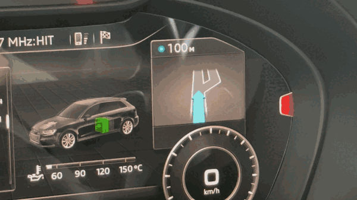
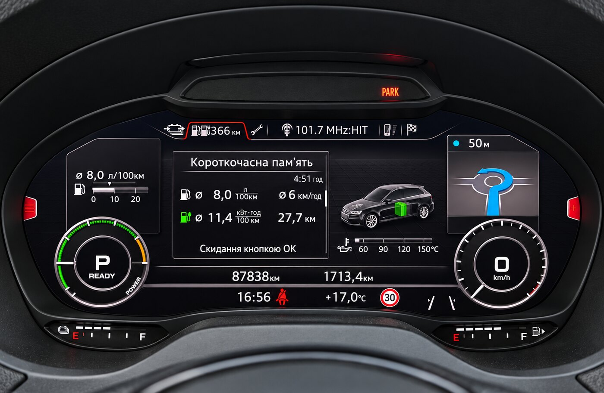

# MHI2 AU37x CarPlay patches

Three patches for Audi MHI2 head units on the **`MHI2_ER_AU37x`** train:

- **Route guidance (RGI)** — CarPlay turn-by-turn maneuvers in the Virtual Cockpit:
  the arrow, the distance to it and the street, in the cluster's own maneuver tile.
  Stock shows them only for the built-in navigation.
- **Cover art** — CarPlay album artwork on the Virtual Cockpit's now-playing widget.
  Stock forwards title/artist/album to the cluster but never the picture.
- **Touchpad → D-pad** — the MMI touchpad navigates CarPlay menus. Stock bridges the
  rotary, the knob press, back and the softkeys, but leaves the touchpad dead.

Prebuilt binaries only. Two ways to install: straight over a network cable, or from an
M.I.B. SD card.

> **Use at your own risk.** These patches copy files onto the head unit's flash and edit
> one system config. Everything is reversible and the installer backs up the one file it
> changes, but a head unit is not a toy. Read
> [Recovery](https://github.com/chefranov/mhi2-au37x-carplay/wiki/Troubleshooting#recovery) *before* you start, and make sure you can
> get a shell on the unit without the screen.

<p align="center"></p>

<p align="center"><sub>A CarPlay maneuver in the cluster, animated, with the distance counting down.</sub></p>

<p align="center"></p>

<p align="center"><sub>Roundabout, second exit, 50 m — drawn in the cluster's own maneuver tile.</sub></p>

<p align="center"></p>

<p align="center"><sub>CarPlay album art on the Virtual Cockpit — stock leaves this tile empty.</sub></p>

## Will it work on my car?

Tested on exactly one build: `MHI2_ER_AU37x_P5089`, `MU1326`, part `8V1035036A`, an Audi
A3 8V Sportback e-tron (2017) with the Virtual Cockpit and the HARMAN iAP2 stack.

Other `MHI2_ER_AU37x_*` builds are expected to work but are not verified. Two things
decide it, and one of them can keep the HMI from starting — **[read Compatibility before
installing](https://github.com/chefranov/mhi2-au37x-carplay/wiki/Compatibility)**.

Three requirements worth knowing up front:

- **Cover art needs the cluster coded for it**: module **17**, adaptation
  `Picture_Upload_Download` set to **active**. Without it the cluster never asks for a
  picture and nothing on the head-unit side can help.
- **The D-pad patch needs no coding**, and is self-contained: copy `bin/dpad_hook.jar`
  into `/mnt/app/eso/hmi/lsd/jars/` and you are done. It is the lowest-risk way to try
  any of this.
- **Route guidance needs no coding either**, but it does need about 35 MB free on
  `/mnt/app` for the maneuver frames, and it replaces the `mm-ipod` binary on that
  partition with a small shim (the original is kept beside it). Skip it at install
  time with `RGI=0`, or turn it off later with one file — see below.

### Which navigation apps work

Route guidance draws whatever the phone publishes over CarPlay, so it depends on the app:

| App | Maneuvers in the cluster |
|---|---|
| **Apple Maps** | yes |
| **Google Maps** | yes |
| Waze | no — Waze publishes no route-guidance data over CarPlay at all |

Waze is not a limitation of this patch and there is nothing here to fix: no data leaves
the phone. If a future Waze build starts sending it, maneuvers will appear with no
change on this side.

## Contents

| Path | What it is |
|---|---|
| `bin/rgd_hook.jar` | HMI patch: turns the phone's route guidance into cluster maneuvers and drives the maneuver tile |
| `bin/librgd_hook.so` | Native hook (ARM/QNX), `LD_PRELOAD`ed into `mm-ipod`: asks iOS for route guidance and forwards it |
| `bin/rgd_frames/` | The pre-drawn maneuver animations, ~3600 PNGs. The cluster driver has no shader compiler, so the arrows are drawn ahead of time and played back as frames |
| `bin/coverart_hook.jar` | HMI patch: pushes the artwork to the cluster and answers its picture requests |
| `bin/dpad_hook.jar` | HMI patch: touchpad drag → CarPlay D-pad |
| `bin/libcarplay_hook.so` | Native hook (ARM/QNX), `LD_PRELOAD`ed into `dio_manager`: pulls the artwork out of iAP2, decodes it, writes a 170×170 PNG |
| `install.sh` | Runs **on the unit**; does the whole install, idempotent |
| `uninstall.sh` | Runs on the unit; puts everything back |
| `custom.sh` | M.I.B. entry point — finds the payload on the card and calls the above |

Exact sizes, worth checking after any download:

```
bin/libcarplay_hook.so   124685
bin/coverart_hook.jar     27993
bin/dpad_hook.jar         11108
bin/librgd_hook.so       188111
bin/rgd_hook.jar         122939
```

**On Windows, download this repository fresh** (clone again, or Code → Download ZIP).
Earlier copies were checked out with CRLF line endings and every script in them fails on
the unit. `.gitattributes` now pins LF, but only for new downloads — the
[repair recipe](https://github.com/chefranov/mhi2-au37x-carplay/wiki/Installation#before-you-copy-anything-windows-line-endings) is
more work than re-downloading.

## Install

Over a network cable, with the USB-Ethernet adapter installed from the M.I.B. menu:

```sh
ssh root@172.16.250.248 'mount -uw /mnt/app; mkdir -p /mnt/app/root/carplay'
scp -O -r bin install.sh uninstall.sh root@172.16.250.248:/mnt/app/root/carplay/
ssh root@172.16.250.248 'sh /mnt/app/root/carplay/install.sh'
```

Then reboot. Do not stage the files under `/tmp` — it holds no directories on this unit.
The copy is a few minutes: most of it is the maneuver frames. To install everything
*except* route guidance, run the installer as `RGI=0 sh /mnt/app/root/carplay/install.sh`.

From an M.I.B. SD card: put `custom.sh` at `/mod/custom.sh` and the rest of the
repository at `/mod/carplay/`, then run `Advanced Settings → Run Custom Script` and
reboot. To leave route guidance out on this path, put an empty file named `NO_RGI`
next to `install.sh` on the card.

Full walkthrough of both, plus a scripts-free manual install and the list of everything
that gets changed: **[Installation](https://github.com/chefranov/mhi2-au37x-carplay/wiki/Installation)**.

Upgrading is just running `install.sh` again — no need to uninstall first.

## Verify

The native hook is quiet unless you ask it to talk — `/tmp` on this unit is RAM, and a
log that grows for the length of a session eats it. Turn it on, then plug in an iPhone
and play something with artwork:

```sh
touch /mnt/app/carplay_verbose
slay -f dio_manager          # picked up on the next start
cat /tmp/carplay_hook.log
```

A healthy run ends with the cluster asking for the picture:

```
[INF] artwork decoded 600x600 (3 ch) -> 170x170
[INF] published coverart: crc=b5012bdf
[CoverArtProvider] requestPicture entryID=0 sourceType=0 known=true
```

If that last line never appears, check the module 17 adaptation. Delete the marker file
when you are done; warnings and errors are logged either way. What the other lines
mean, and what to do when they are missing:
**[Verifying and troubleshooting](https://github.com/chefranov/mhi2-au37x-carplay/wiki/Troubleshooting)**.

Route guidance needs no marker to check: start a route in Apple Maps or Google Maps
with the phone plugged in, and the maneuver appears in the cluster tile within a second
or two. Its own log is always on, small and bounded:

```sh
cat /mnt/app/rgd_hook.log
```

## Turning route guidance off

It does not have to be uninstalled to be switched off:

```sh
ssh root@172.16.250.248 'mount -uw /mnt/app; touch /mnt/app/rgd_disable'
```

Reboot, and the unit behaves as if the patch were not there: the cluster keeps its own
navigation, and nothing of ours is loaded into `mm-ipod` or the HMI. Delete the file and
reboot to turn it back on. The other two patches are unaffected either way.

While it is on, CarPlay owns the maneuver tile whenever a route is running on the phone,
and the built-in navigation gets it back the moment that route ends or is cancelled.

## Uninstall

```sh
ssh root@172.16.250.248 'sh /mnt/app/root/carplay/uninstall.sh'
```

or create an empty `/mod/carplay/UNINSTALL` on the card and run the custom script again.
Reboot afterwards.

## Credits

Derived from [luka-dev/mib2q-carplay-rgi](https://github.com/luka-dev/mib2q-carplay-rgi) —
the HMI class-patch pattern and the cover-art pipeline come from there. That project
targets the Cinemo/Qualcomm MHI2Q stack; the native side here is a rewrite for the HARMAN
iAP2 stack these AU37x units use.

Thanks to [Mich795](https://github.com/Mich795), who took this build apart and sent back
a version of their own. Several fixes in the 2026-09-03 release came from reading it: the
session boundary that stops the first cover of a session being discarded as a duplicate,
dropping a fetch when the phone has already moved to another track, retrying a fetch whose
bytes have not arrived yet, and reusing artwork already built.

Route guidance follows the same lineage: the BAP protocol work, the cluster-side
constants and the Java half's shape are Luka's. The maneuver frames are drawn by his
renderer; this unit's driver ships no shader compiler, so instead of running that
renderer on the head unit the frames are drawn ahead of time and played back.
